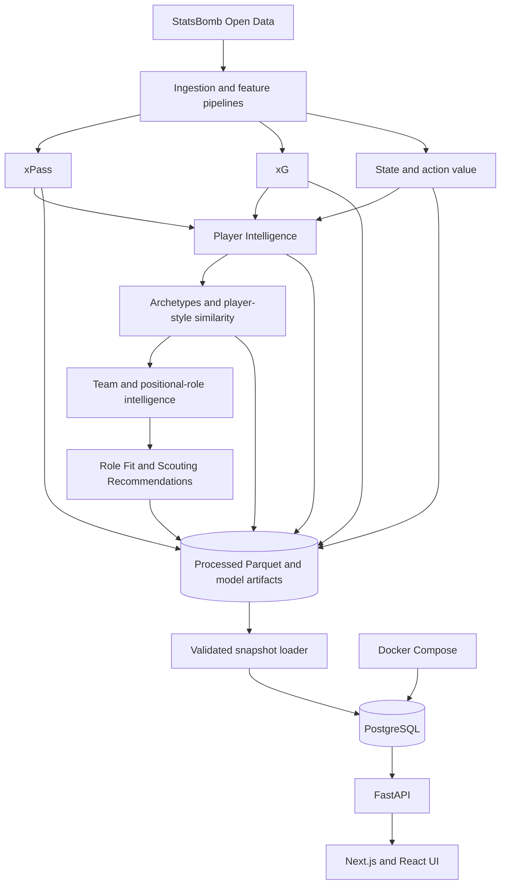

# FootyScout

FootyScout is a full-stack football scouting and analytics platform that uses event-level match data to model pass difficulty, expected goals, attacking action value, player style, team roles, and scouting fit. Its production analytics are precomputed into reproducible Parquet/model artifacts, loaded into PostgreSQL, exposed through FastAPI, and presented in a responsive Next.js interface.

FootyScout is an analytical scouting aid. It is not an LLM application, transfer-success predictor, or player-quality oracle.

## Features

### Passing Intelligence

- Expected pass completion (xPass) and pass difficulty
- Actual completion compared with expectation
- Under-pressure, progressive, long-pass, and final-third analysis
- Filterable player pass maps

### Attacking Value

- Non-penalty expected goals (xG)
- Possession-state value and event-level attacking action value
- Pass value, carry value, shooting profiles, and attacking profiles
- Shot and carry visualizations

### Player Intelligence

- Position-aware style and performance percentiles
- Separate style tendencies and execution/output measures
- `Direct Progressor` and `Safe Circulator` playing-style archetypes
- Same-position player-style similarity with six recommendations
- Sample-support indicators kept separate from scores and rankings

### Team Intelligence & Scouting

- Bayer Leverkusen's 34-match Team Intelligence profile
- Pooled DEF, MID, and FWD positional-role profiles
- Role Fit: observed player-style distance to the matching Leverkusen role
- Scouting Recommendation Engine ranked only by same-position Role Fit
- Visible player-sample and FWD contributor-diversity limitations

## Architecture

FootyScout serves precomputed analytics snapshots; the API does not train models during requests.



## Analytics overview

### V1 — Passing Intelligence

Each pass is a supervised binary example built from leakage-safe, pre-outcome event features. Logistic Regression, a PyTorch MLP, and XGBoost were evaluated with match-grouped splits; XGBoost was selected by validation probability metrics. The production output is an out-of-fold expected-completion probability for every product pass.

### V2 — Attacking Value

The xG model estimates the probability that a non-penalty shot becomes a goal and was trained on a broader, match-grouped StatsBomb Open Data corpus. The state-value model estimates the expected-goal quantity remaining in a possession. Successful on-ball action value is `V(after) - V(before)`; failed or possession-ending actions transition to zero. These values are observational and model-derived, not causal effects.

### V3 — Player Intelligence

Player style uses position-relative passing and carrying dimensions. Production archetypes come from deterministic `KMeans(k=2)` and describe `Direct Progressor` and `Safe Circulator` tendencies, not ability. Similar players are compared in a six-dimensional, broad-position-normalized style space using RMS Euclidean distance. A cohort-calibrated similarity index is displayed separately from sample support.

### V4 — Team Intelligence / Tactical Fit

Leverkusen's DEF, MID, and FWD role vectors pool the observed events/actions of players assigned to each frozen broad position. A player and the matching role share the same V3.3B six-dimensional position-relative coordinate system. Role Fit is RMS distance between those vectors; lower is closer. Current Leverkusen players use leave-self-out roles, while external recommendations use the full role. Sample support, archetype, and performance metrics never change Role Fit or ranking.

## Data scope and interpretation

The product cohort uses available StatsBomb 2023/24 Bundesliga event data. Bayer Leverkusen has all 34 league matches in the current sample; every other Bundesliga club is represented only by its two matches against Leverkusen. Consequently, production full-season Team Intelligence is currently available only for Leverkusen, and many external player profiles reflect one or two observed matches.

FootyScout surfaces that support explicitly. Role Fit and Scouting Recommendations describe observed style resemblance. They do not predict transfer success, future performance, coaching intent, causal tactical compatibility, or player quality.

Source match data comes from [StatsBomb Open Data](https://github.com/hudl/open-data). FootyScout does not own the source event data. Any publication, sharing, or distribution of analysis derived from it must follow the repository's published terms, including identifying StatsBomb as the data source and using the official [StatsBomb media assets](https://statsbomb.com/media-pack/) where required.

## Tech stack

| Area | Technologies |
|---|---|
| Frontend | TypeScript, React 19, Next.js 16, Tailwind CSS 4, Campos |
| Backend | Python 3.12, FastAPI, SQLAlchemy 2, Alembic, PostgreSQL 16 |
| Analytics and ML | pandas, NumPy, SciPy, scikit-learn, XGBoost, PyTorch |
| Infrastructure and testing | Docker Compose, pytest, Ruff, Vitest, Testing Library, ESLint |

PyTorch remains meaningful as the evaluated xPass MLP benchmark; XGBoost is the selected production family for xPass and xG.

## Quick start

### Prerequisites

- Python 3.12
- Node.js 22.22.2 or newer and npm
- Docker Desktop or Docker Engine with Docker Compose

### 1. Clone and configure

```powershell
git clone <repository-url>
Set-Location footyscout
Copy-Item .env.example .env
```

The checked-in examples contain local-development defaults only. PostgreSQL intentionally maps host port `5433` to container port `5432`. Set `DATABASE_URL` and related environment values in ignored `.env` files when using different credentials or hosts.

### 2. Start PostgreSQL

```powershell
docker compose up -d db
docker compose ps
```

### 3. Install the backend

```powershell
Set-Location backend
python -m venv .venv
.\.venv\Scripts\Activate.ps1
python -m pip install --upgrade pip
python -m pip install -e ".[dev]"
Copy-Item .env.example .env
python -m alembic upgrade head
```

Generated analytics are intentionally not committed. To populate a fresh clone, complete the [analytics snapshot rebuild](#rebuild-the-analytics-snapshot), then run:

```powershell
python -m scripts.load_database
python -m uvicorn app.main:app --reload --port 8000
```

### 4. Install the frontend

In another terminal:

```powershell
Set-Location frontend
npm ci
Copy-Item .env.example .env.local
npm.cmd run dev
```

- Frontend: <http://localhost:3000>
- Backend: <http://localhost:8000>
- Swagger UI: <http://localhost:8000/docs>

## Rebuild the analytics snapshot

Run these commands from `backend/` after installing its dependencies. The ingestion steps use network access and the complete rebuild is compute-intensive.

```powershell
# V1 — passes, xPass, and passing profiles
python -m scripts.download_statsbomb
python -m analytics.pass_features
python -m analytics.train_pass_model

# V2 — xG, event states, and attacking action value
python -m scripts.download_statsbomb_shots
python -m analytics.train_xg_model
python -m scripts.download_statsbomb_events
python -m analytics.train_action_value_model

# V3 — player intelligence, research audits, archetypes, and similarity
python -m analytics.player_intelligence
python -m analytics.player_style_stability --normalized-pass-threshold 50 --normalized-carry-threshold 29
python -m analytics.player_archetype_analysis
python -m analytics.player_archetypes
python -m analytics.player_similarity_analysis
python -m analytics.player_similarity

# V4 — frozen feasibility evidence and production team intelligence
python -m analytics.team_role_research
python -m analytics.team_intelligence

# Persist the validated snapshot
python -m alembic upgrade head
python -m scripts.load_database
```

Research artifacts from V3.2A/B, V3.3A, and V4.0 are retained locally because they document selection, stability, and methodology. They are not runtime API dependencies after the production snapshot is loaded.

## Project structure

```text
footyscout/
├── backend/
│   ├── analytics/     Feature, model, profile, research, and production pipelines
│   ├── app/           FastAPI, SQLAlchemy models, schemas, and routers
│   ├── alembic/       Database migrations
│   ├── scripts/       StatsBomb ingestion and snapshot loading
│   └── tests/         Backend unit, artifact, persistence, and API tests
├── frontend/
│   ├── app/           Next.js routes
│   ├── components/    Product and football-visualization components
│   └── lib/           Typed API client, formatting, and mapping utilities
├── data/
│   ├── raw/           Local source data; ignored by Git
│   └── processed/     Generated analytics snapshots; ignored by Git
├── models/            Generated models and metadata; ignored by Git
├── .github/workflows/ Continuous integration
└── docker-compose.yml Local PostgreSQL service
```

## Product routes

| Frontend | Purpose |
|---|---|
| `/` | Product overview and leaderboard preview |
| `/players` | Searchable player explorer |
| `/players/[id]` | Passing, attacking, intelligence, similarity, and Role Fit profile |
| `/archetypes` | Playing-style archetype catalogue |
| `/leaderboard` | Passing leaderboards |
| `/compare` | Two-player comparison |
| `/model` | Methodology and model evaluation |
| `/model/xg` | xG evaluation and methodology |
| `/model/action-value` | State/action-value evaluation and methodology |
| `/teams/[id]` | Team Intelligence and positional roles |
| `/scouting` | Leverkusen Scouting Recommendation Engine |

Major API routes include:

- `GET /health`
- `GET /api/players`
- `GET /api/players/{id}`
- `GET /api/players/{id}/passes`
- `GET /api/players/{id}/shooting`
- `GET /api/players/{id}/attacking`
- `GET /api/players/{id}/intelligence`
- `GET /api/players/{id}/similar`
- `GET /api/players/{id}/role-fit`
- `GET /api/archetypes`
- `GET /api/model`
- `GET /api/models/xg`
- `GET /api/models/action-value`
- `GET /api/teams/{id}/intelligence`
- `GET /api/teams/{id}/roles`
- `GET /api/teams/{id}/roles/{position}`
- `GET /api/teams/{id}/roles/{position}/recommendations`

## Testing

From `backend/`:

```powershell
python -m pytest
ruff check .
```

Artifact contract tests expect the locally generated production outputs. CI excludes only those artifact-presence tests and still runs the unit, transformation, persistence, and API suites.

From `frontend/`:

```powershell
npm.cmd run test
npm.cmd run lint
npm.cmd run build
```

## Generated artifacts and publication

Raw data, processed Parquet files, model binaries, plots, caches, and real `.env` files are ignored. This keeps the source repository small and avoids redistributing event data or environment-specific outputs. All production and research artifacts can be regenerated using the ordered pipeline above.

No project `LICENSE` file is currently included. Choose a license before public release if you want other people to have explicit reuse rights; that choice does not replace StatsBomb's separate data terms.
